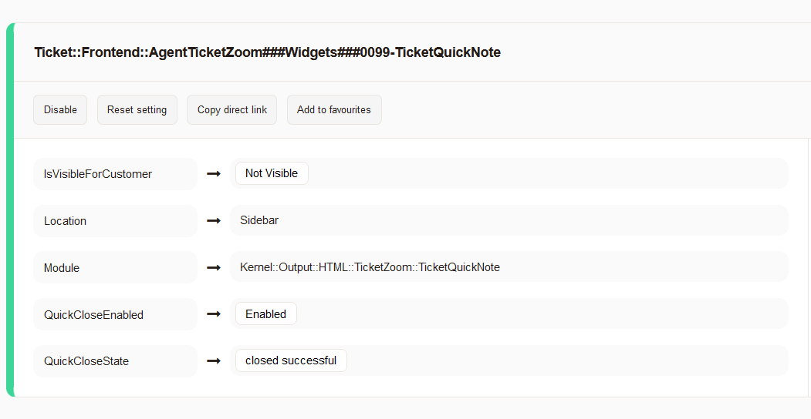
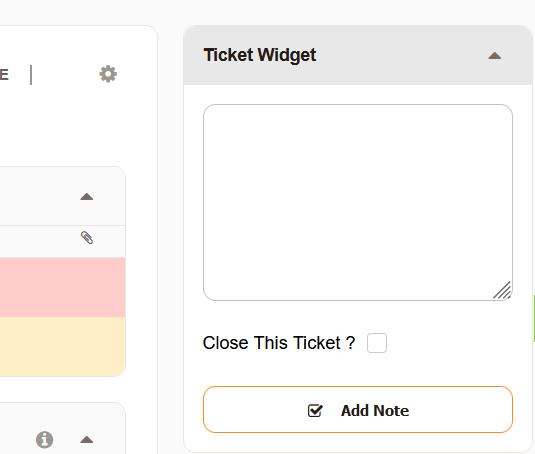

# OTRS Znuny Quick Note
- Built based on Znuny 7.0. 
- Should work on Znuny LTS and OTRS Community Edition (Not Tested)
- Quick ticket note widget allow agent to add quick note to the ticket and close the ticket (configurable)

1. To enable option to close the ticket, see 

        Ticket::Frontend::AgentTicketZoom###Widgets###0099-TicketQuickNote 

